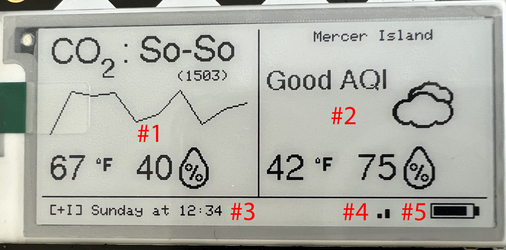
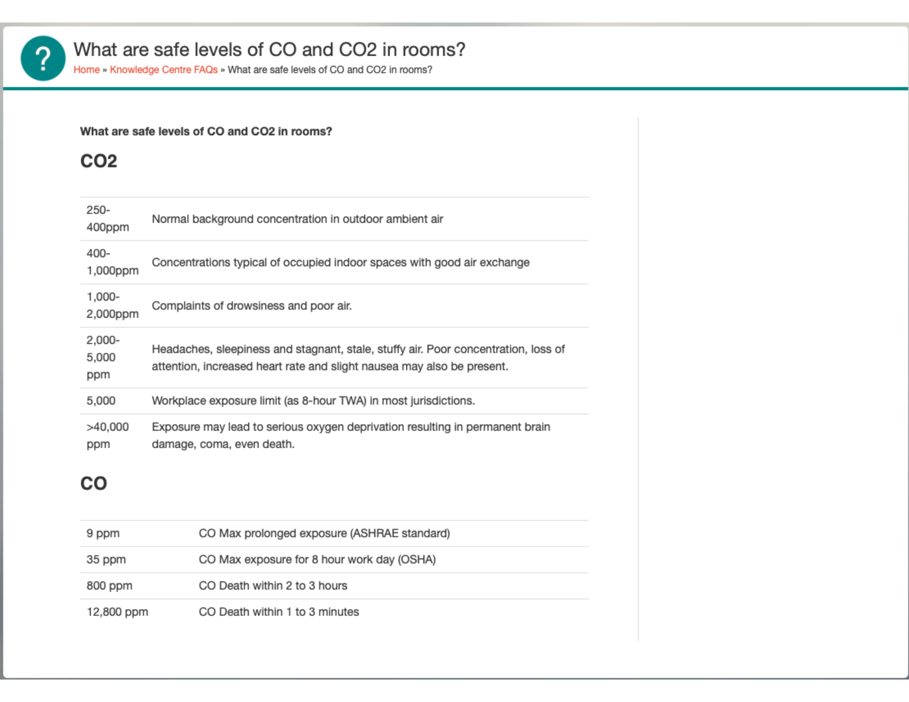
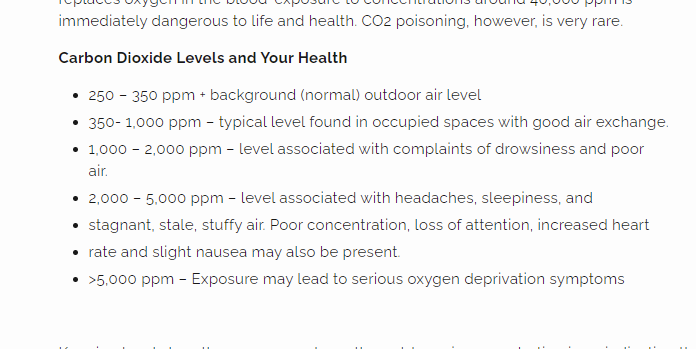

# Air Quality
AI: PUT HERO SHOT HERE

## Purpose
Air Quality, aka AQ, captures temperature, humidity, and if configured with the appropriate sensor, CO2 (carbon dioxide) values. If AQ is configured with a screen, it can display this information. If AQ is connected to WiFi, it can log this information to a number of network endpoints, and it displays local outdoor weather and air quality information to compliment the indoor sensor information.

AQ was created to determine if the CO2 level in the room was "good" and grew into a fuller featured room air quality monitor.

## Associated projects
AQ has a number of sibling projects that share common hardware and code attributes:
- [Powered Air Quality](https://github.com/ericklein/powered_air_quality) has all of the features of AQ along with the ability to sample local air particulate levels. This project uses an AC power source.
- [RCO2](https://github.com/ericklein/rco2) is a small, portable version of AQ that only samples and displays air quality levels.
- [Badge](https://github.com/ericklein/badge) is RCO2 in a badge form factor capable of displaying additional information beyond air quality levels.

## Features

### Indoor air quality information (#1)
- If available, displays the US standard CO2 label and value
- Displays the temperature and humidity
### Outside air quality information (#2)
- Uses OpenWeatherMap data, if available, to display
	- latest air quality information
	- current weather condition as icon
	- temperature and humidity levels
### Data publishing information (#3)
- displays the last time the screen information was updated.
- [+I] the indoor temperature, humidity, and CO2 information was successfully published to the defined InfluxDB server
- [+M] the indoor temperature, humidity, and CO2 information was successfully published to the defined MQTT broker
### WiFi signal strength (#4)
- based on RSSI
### Battery level (#5)

## Target configuration
- Set parameter configuration using config.h
- Private configuration settings including WiFi SSID/password and network endpoint credentials are contained in a `secrets.h` file that is not included in this repo.  Instead you'll find the file `secrets_template.h`, which should be copied to `secrets.h` and then edited to supply the right access credentials and configuration values to match your deployment environment.

## Bill of Materials (BOM)
### MCU
- [Adafruit MagTag](https://www.adafruit.com/product/4800)
- [Adafruit ESP32V2 Feather](https://www.adafruit.com/product/5400)
	- core code is fairly portable
### WiFi
- [Adafruit MagTag](https://www.adafruit.com/product/4800)
	- any ESP32
### Sensors
- [AHT20 temp/humidity sensor](https://www.adafruit.com/product/4566)
	- or similar AHT20 parts
- [BME280 temp/humidity sensor](https://www.adafruit.com/product/2652)
- [SCD40 temp/humidity/CO2 sensor](https://www.adafruit.com/product/5187)
	- SCD40 used in most of our build configurations
	- can use any SCD40 connected over i2c
### Battery
#### monitor
- [LC709203F battery voltage monitor](https://www.adafruit.com/product/4712)
- [GPIO pin on ESP32V2 Feather](https://www.adafruit.com/product/5400)
#### battery
- standard LiPo battery with JST 2-PH cable
### Screen
- [Adafruit MagTag (EPD)](https://www.adafruit.com/product/4800)
- [Adafruit 2.9" E-Ink Featherwing](https://www.adafruit.com/product/4777)
### Buttons/Switches
- [Adafruit MagTag](https://www.adafruit.com/product/4800)
	- on/off switch
### Pinouts
- SCD40
    - Stemma QT cable between MCU board and SCD40 board
        - or connect 3.3v/5v, GND, SDA, SCL on both sides
- LC709203F
    - Stemma QT cable between MCU board and SCD40 board
        - or connect 3.3v/5v, GND, SDA, SCL on both sides
## Supported network endpoints
### MQTT
- uncomment #define MQTT in config.h
- set appropriate parameters in config.h and secrets.h
	- Technical References
		- https://hackaday.com/2017/10/31/review-iot-data-logging-services-with-mqtt/
### Hassio MQTT
- AI: ADD DOCUMENTATION
### InfluxDB
- AI: ADD DOCUMENTATION
### DWEET
- AI: ADD DOCUMENTATION

## Issues and Feature Requests
- [Github Issues](https://github.com/ericklein/air_quality/issues)

## .plan (big ticket items)
- [WiFI Manager](https://github.com/tzapu/WiFiManager) support
- OTA firmware update support
- Change hardware to non ESP32S2 MCU, allowing multiple GPIO pin wakeup, which enables button presses to cycle through multiple information screens
## Supporting Material
### Screen
- Good Display SPI; GDEW029T5D 2.9" b/w 128x296, UC8151D 
- https://cdn-learn.adafruit.com/downloads/pdf/adafruit-gfx-graphics-library.pdf
### Battery
- [LC709203F datasheet](readme/LC709203F_datasheet.pdf)
### Temperature and Humdity
- [Ideal indoor humidity](https://iaq.works/humidity/indoor-humidity-level-why-is-the-40-60-range-ideal/)
### CO2 (Carbon Dioxide)
#### Scales
We currently use the following scale:
- <800 - Good
- 800-999 - So-So
- 1000+ - Poor
##### Alternate ideas
- 
- 
- 
#### Impact on health
- [CO2 and indoor air quality](readme/CO2_and_indoor_air_quality.pdf)
#### Sensors
- [AHT20 info](https://learn.adafruit.com/adafruit-aht20)
- [CO2 sensor types](https://www.airgradient.com/blog/co2-sensors-photo-acoustic-vs-ndir-updated/)
- SCD40 sensor
	- [SCD40 datasheet](readme/Sensirion_CO2_Sensors_SCD4x_Datasheet.pdf)
### AQI
- [AQI Overview](readme/aqi_overview.md)
- [Open Weather Map Air Pollution API](https://openweathermap.org/api/air-pollution)
- [OSHA Air Quality](readme/OSHA_Indoor_Air_Quality.pdf)
- [Great site for air quality info](https://itsairborne.com/)
- [NYT on indoor gas stoves](https://www.nytimes.com/2023/01/29/climate/gas-stove-health.html)